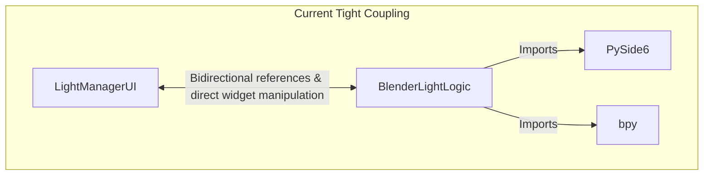
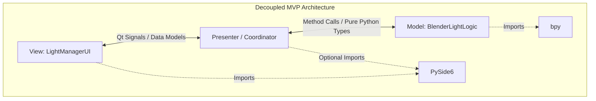

# Architectural Analysis: Decoupling UI & Logic in Blender Light Manager

This document analyzes the current coupling between the user interface and Blender-specific logic in the **Blender Light Manager** codebase, and proposes a refactoring blueprint to achieve a clean separation of concerns.

---

## 1. Current State Assessment

Currently, the codebase has two primary classes:
1. `LightManagerUI` ([LightManagerUI.py](file:///home/yoshi/Project_PYTHON/DCC/BLENDER/Blender_Light_Manager/LightManagerUI.py)): Defines the PySide6 layout, widget hierarchy, and defines Qt Signals.
2. `BlenderLightLogic` ([BlenderLightLogic.py](file:///home/yoshi/Project_PYTHON/DCC/BLENDER/Blender_Light_Manager/BlenderLightLogic.py)): Implements operators and data synchronization between Blender's `bpy` context and PySide6 widgets.

### The Problem: Tight Coupling
Although the files are separated, they are **strongly coupled**. Specifically:
* **UI widgets in the logic class:** `BlenderLightLogic` directly manipulates PySide6 widgets (e.g., calling `light_table.insertRow()`, `light_table.setCellWidget()`, and clearing items). It is responsible for instantiating GUI components like `QTableWidgetItem`, `QLabel`, `QPushButton`, and `QCheckBox`.
* **State querying via the GUI:** The logic retrieves data directly from UI elements (e.g., checking checkbox state with `mute_cb.isChecked()` or fetching combo selections with `self.ui.combo_view_layer.currentText()`).
* **Direct dependencies:** `BlenderLightLogic.py` imports `PySide6` UI components, meaning the core Blender logic cannot be run or unit-tested headless (without an active display environment and `QApplication`).
* **Mixed responsibility:** GUI dialogs (like `QColorDialog` for selecting a light color) are opened and driven inside the logic class.



---

## 2. Refactoring Proposal: Model-View-Presenter (MVP)

To make the UI and logic completely independent, we should transition to a **Model-View-Presenter** architecture:

1. **Model (Blender Context):** Handles all operations on the Blender database (`bpy`). It has **zero dependencies** on PySide6 or Qt. It speaks in pure Python data types (lists, dicts, dataclasses).
2. **View (PySide6 UI):** Defines layout and styling. It has **zero dependencies** on `bpy` or Blender logic. It raises abstract events (Qt Signals) for user actions.
3. **Presenter (Coordinator):** The glue layer. It subscribes to View events, invokes the Model to process actions/fetch data, and maps pure Python data back to the View.



---

## 3. Step-by-Step Refactoring Plan

### Step 3.1: Define a Pure Python Data Representation
Create a dataclass or dictionary structure that represents a light's state. The logic layer should only return these structures, and the UI layer should populate itself using them.

```python
from dataclasses import dataclass

@dataclass
class LightState:
    name: str
    is_visible: bool
    is_soloed: bool
    type: str  # POINT, SUN, SPOT, AREA
    color: tuple[float, float, float]
    exposure: float
    use_temperature: bool
    temperature: float
    radius: float
    use_shadow: bool
    lightgroup: str
```

### Step 3.2: Clean the Logic Class (Model)
Remove all imports of `PySide6.QtWidgets`, `PySide6.QtGui`, and `PySide6.QtCore` from `BlenderLightLogic.py`.

```python
# BlenderLightLogic.py (Decoupled Model)
import bpy
from .models import LightState  # Pure Python dataclass

class BlenderLightLogic:
    def get_all_lights(self) -> list[LightState]:
        """Queries Blender and returns a list of pure Python light representations."""
        # Query Blender scene lights using bpy
        # Populate and return a list of LightState objects
        pass

    def create_light(self, name: str, light_type: str):
        """Creates a light in Blender without knowing about the table widget."""
        # bpy light creation logic...
        pass
        
    def set_light_color(self, light_name: str, color: tuple[float, float, float]):
        """Sets color on bpy object directly."""
        pass
```

### Step 3.3: Refactor the UI Class (View)
Modify `LightManagerUI.py` so it exposes simple interface methods to receive data, and handles all widget creation, layouts, and Qt event processing inside itself.

```python
# LightManagerUI.py (Decoupled View)
from PySide6.QtWidgets import QWidget
from .models import LightState

class LightManagerUI(QWidget):
    # Signals for user actions
    signal_create_requested = Signal(str, str)  # (name, type)
    signal_color_change_requested = Signal(str)  # (light_name)
    
    def populate_table(self, lights: list[LightState]):
        """Populates the QTableWidget using clean Python data objects."""
        self.light_table.setRowCount(0)
        for light in lights:
            # Create Table Items, Buttons, Checkboxes here...
            pass

    def show_color_picker(self, current_color: tuple[float, float, float]) -> tuple[float, float, float]:
        """Handles GUI dialogs locally within the View."""
        # QColorDialog implementation...
        pass
```

### Step 3.4: Create the Presenter (Coordinator)
The Presenter initializes both components, handles routing between them, and drives updates.

```python
# LightManagerPresenter.py (Presenter)
class LightManagerPresenter:
    def __init__(self, view, model):
        self.view = view
        self.model = model
        self.connect_signals()

    def connect_signals(self):
        self.view.signal_create_requested.connect(self.on_create_light)
        self.view.signal_color_change_requested.connect(self.on_color_change)

    def on_create_light(self, name, light_type):
        self.model.create_light(name, light_type)
        self.refresh_view()

    def on_color_change(self, light_name):
        # 1. Fetch current color from Model
        current_color = self.model.get_light_color(light_name)
        # 2. Open dialog in View
        new_color = self.view.show_color_picker(current_color)
        if new_color:
            # 3. Save color back to Model
            self.model.set_light_color(light_name, new_color)
            self.refresh_view()

    def refresh_view(self):
        lights_data = self.model.get_all_lights()
        self.view.populate_table(lights_data)
```

---

## 4. Key Benefits of this Decoupling

1. **Headless Unit Testing:** You can write automated tests to verify light creation, deletion, renaming, and attribute setting in Blender *without* ever initializing a PySide6 GUI window or QApplication.
2. **Framework Independence:** If you decide to transition from PySide6 to Blender's native UI system (`bpy.types.Panel` / HTML side-panel / Web Interface), the core Blender logic (`BlenderLightLogic`) remains **completely untouched**.
3. **Clear Code Ownership:** UI issues are resolved inside `LightManagerUI.py`, and data manipulation bugs are resolved in `BlenderLightLogic.py`.
4. **Improved Reentrancy and Threading:** Eliminates race conditions where Blender depsgraph updates fire while a UI widget callback is modifying data, avoiding common Blender crashes.
